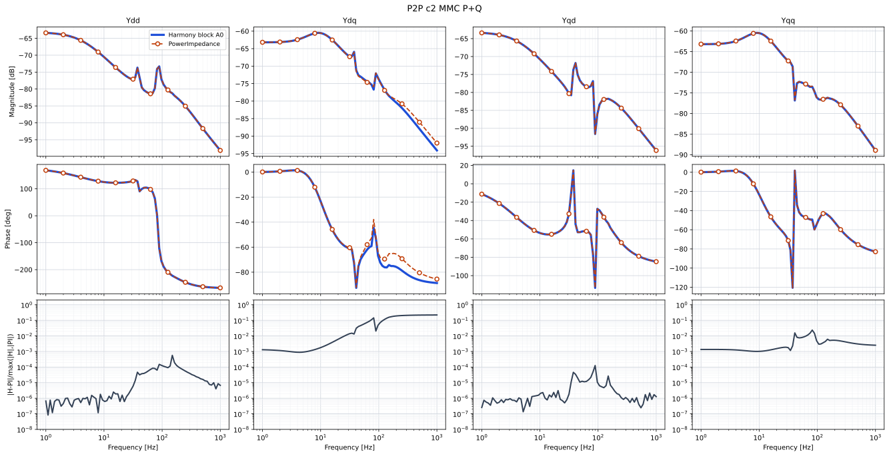
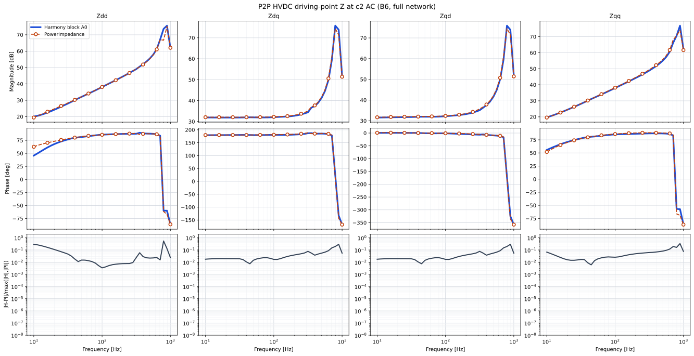
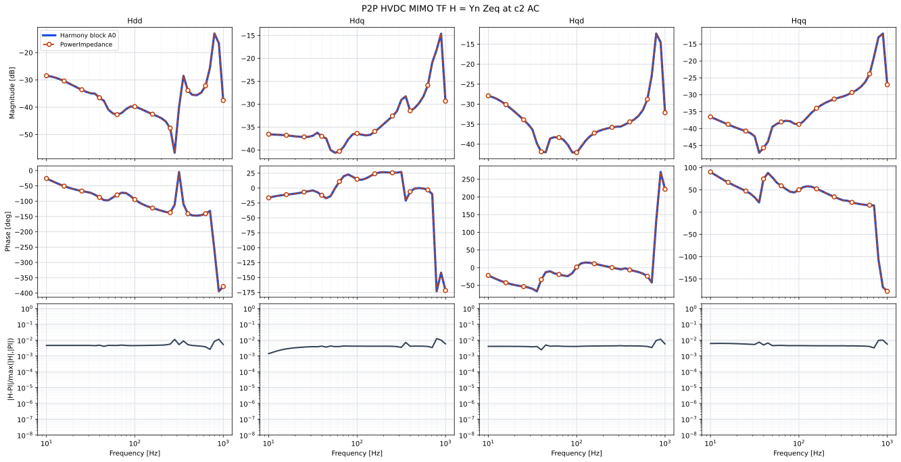
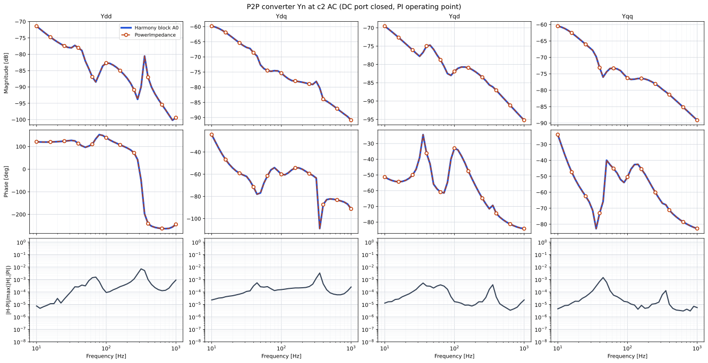
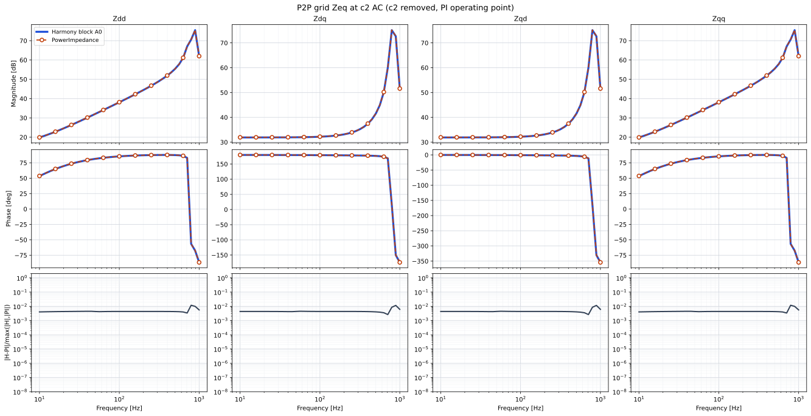

# Harmony vs PowerImpedance.jl

Standalone admittance, OHL/cable topologies, and the P2P HVDC network,
compared against [PowerImpedance.jl](https://github.com/Electa-Git/PowerImpedance.jl)
0.3.0.

```
powerimpedance/
  standalone/
    harmony/          resistor, transformer, cable, OHL, MMC JSON
    results/          overlay_*.svg
    run_pi.jl
  lines/
    harmony/          line_topologies.json
    geometry.md       named organizations vs PSCAD
    results/          overlay_ohl_*.svg, overlay_cable_*.svg
    run_pi_lines.jl
  p2p/
    harmony/p2p.json          gtest (Harmony OPF)
    harmony/p2p_pi_op.json    overlays (shared operating point)
    results/                  overlay_p2p_*.svg
    run_pi_networks.jl
```

Overlays: Harmony **blue solid**, PowerImpedance **orange dashed**
(magnitude, unwrapped phase, relative error). Checked-in artefacts are
**SVG overlays only**.

All Harmony vs PowerImpedance.jl cases live under this folder.

## Redo the plots

From the repository root, with the `harmony` conda env, Gurobi on `PATH`,
and Julia 1.10+:

```bash
julia --project=benchmarking/powerimpedance -e "using Pkg; Pkg.instantiate()"
python benchmarking/powerimpedance/run_all.py
```

On Windows set `PYTHONIOENCODING=utf-8`. That script rebuilds JSON, sweeps
PowerImpedance, runs Harmony, writes overlays, and deletes intermediate CSVs.

```bash
python benchmarking/powerimpedance/run_all.py --case standalone
python benchmarking/powerimpedance/run_all.py --case lines
python benchmarking/powerimpedance/run_all.py --case p2p
python benchmarking/powerimpedance/run_all.py --skip-julia
```

The gtest `P2PBlockParkVsPerComponent` loads `p2p/harmony/p2p.json` and
checks Harmony block Park vs per-component Park. It is not a
PowerImpedance.jl comparison. The P2P *overlays* use `p2p_pi_op.json`
(linearised at the PowerImpedance power-flow point, OPF skipped).

## Execution times

Wall times on this machine (2026-09-01, Windows, Julia 1.11.6, Harmony
Release). Julia includes package compile on a cold start.

| Step | Wall |
|------|------|
| PowerImpedance standalone `run_pi.jl` | ~1 min |
| PowerImpedance line topologies `run_pi_lines.jl` | ~1 min |
| PowerImpedance P2P network (`run_pi_networks.jl`, incl. PF) | ~2 min |
| Harmony standalone MMC JSON | ~5 s each |
| Harmony P2P `p2p_pi_op.json` | ~5 s |
| `compare.py` overlays | ~30 s |
| `run_all.py` (everything) | ~5–8 min |

`run_all.py` prints a per-case breakdown at the end (`TIMING` / `wall`).

## Standalone

JSON: `standalone/harmony/`. Overlays: `standalone/results/`.

Relative Frobenius $\|Y_H-Y_{PI}\|/\|Y_{PI}\|$ (81 or 41 log points):

| Case | Samples | Mean | Max |
|------|---------|------|-----|
| resistor | 11 | $0$ | $0$ |
| Y-Y transformer | 41 | $1.11\times 10^{-6}$ | $3.17\times 10^{-6}$ |
| aerial cable $Y$ | 41 | $1.64\times 10^{-4}$ | $1.60\times 10^{-3}$ |
| OHL $Y$ | 41 | $2.71\times 10^{-4}$ | $2.93\times 10^{-3}$ |
| GFL MMC $Y$ | 81 | $7.21\times 10^{-4}$ | $1.43\times 10^{-3}$ |
| c1 $Y_{\mathrm{ac}}$ (Vdc+Q) | 81 | $7.40\times 10^{-4}$ | $1.95\times 10^{-3}$ |
| c2 $Y_{\mathrm{ac}}$ (P+Q) | 81 | $6.74\times 10^{-4}$ | $1.19\times 10^{-3}$ |

MMC AC current rows from PowerImpedance are sign-flipped (load vs generator)
before the comparison.

### Standalone c1 ($V_{\mathrm{dc}}+Q$)


### Standalone c2 ($P+Q$)



## Line topologies

JSON: `lines/harmony/line_topologies.json`. Geometry vs PSCAD:
[`lines/geometry.md`](lines/geometry.md). Overlays: `lines/results/`.

21 log points, $10$–$1000\,\mathrm{Hz}$:

| Case | Mean | Max |
|------|------|-----|
| `ohl_flat2` twin bundle | $2.19\times 10^{-5}$ | $1.78\times 10^{-4}$ |
| `ohl_flat3` | $3.62\times 10^{-3}$ | $3.80\times 10^{-3}$ |
| `ohl_flat3_nogw` | $8.75\times 10^{-3}$ | $1.02\times 10^{-2}$ |
| `ohl_flat6` | $1.61\times 10^{-2}$ | $2.00\times 10^{-2}$ |
| `ohl_vert3` | $2.16\times 10^{-2}$ | $3.81\times 10^{-2}$ |
| `ohl_vert6` | $1.78\times 10^{-2}$ | $2.66\times 10^{-2}$ |
| `ohl_delta3` | $1.34\times 10^{-2}$ | $2.39\times 10^{-2}$ |
| `ohl_delta6` | $1.28\times 10^{-2}$ | $1.99\times 10^{-2}$ |
| `ohl_conc3` / `ohl_off3` | $1.41\times 10^{-2}$ | $2.35\times 10^{-2}$ |
| `ohl_conc6` | $1.18\times 10^{-2}$ | $1.73\times 10^{-2}$ |
| `ohl_vert3_twin` | $3.29\times 10^{-2}$ | $5.79\times 10^{-2}$ |
| aerial / UG cables | $2.42\times 10^{-4}$ | $1.41\times 10^{-3}$ |

`vertical` $n^b=3$ and `delta` $n^b=3$ use the same centres in Harmony and
PowerImpedance; those centres are not PSCAD 3V/3D. Cable $\varepsilon_0$
differs by one digit (Harmony SI $8.854\times 10^{-12}$, PI $8.85\times 10^{-12}$).

## P2P HVDC

```
g4 -- tl1 (25 km) -- c1 -- DC cable (100 km) -- c2 -- tl78 (90 km) -- g1
```

Cut: inverter PCC (c2 AC / B6). c1 is $V_{\mathrm{dc}}+Q$; c2 is $P+Q$.
Bases $S=1000\,\mathrm{MW}$, $V_{\mathrm{ac,LL}}=380\,\mathrm{kV}$,
$V_{\mathrm{dc}}=800\,\mathrm{kV}$. Setpoints $P=\mp 100\,\mathrm{MW}$,
$Q=+100\,\mathrm{MVAR}$.

$$
Z_{\mathrm{in}}=(Y_n+Y_{\mathrm{eq}})^{-1},\qquad
H=Y_n Z_{\mathrm{eq}}.
$$

JSON: `p2p/harmony/`. Overlays: `p2p/results/`. Linearised at the
PowerImpedance power-flow operating point (`p2p_pi_op.json`).

| Quantity | Samples | Mean Frob | Max |
|----------|---------|-----------|-----|
| DC cable $Y$ (phase 4×4) | 41 | $2.39\times 10^{-4}$ | $1.65\times 10^{-3}$ |
| $Z_{\mathrm{eq}}$ at B6 | 41 | $4.59\times 10^{-3}$ | $1.05\times 10^{-2}$ |
| $Y_n$ at B6 | 41 | $2.76\times 10^{-4}$ | $3.43\times 10^{-3}$ |
| $Z_{\mathrm{in}}$ at B6 | 41 | $5.52\times 10^{-2}$ | $0.376$ |
| $H$ at B6 | 41 | $4.63\times 10^{-3}$ | $1.05\times 10^{-2}$ |

### $Z_{\mathrm{in}}$ at B6



### $H$ at B6



### $Y_n$ at B6



### $Z_{\mathrm{eq}}$ at B6


