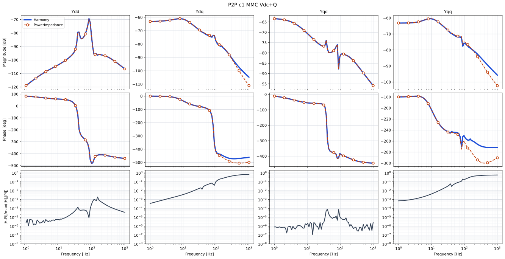
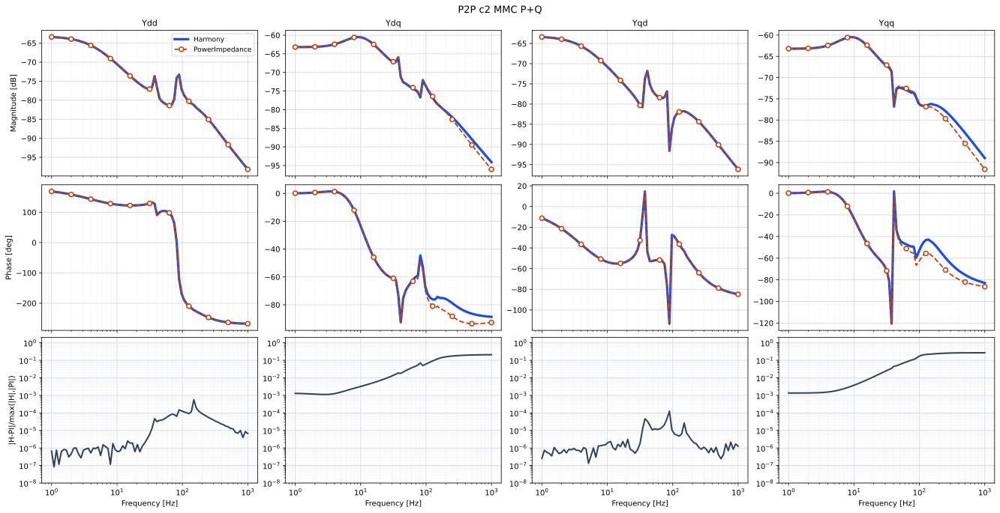
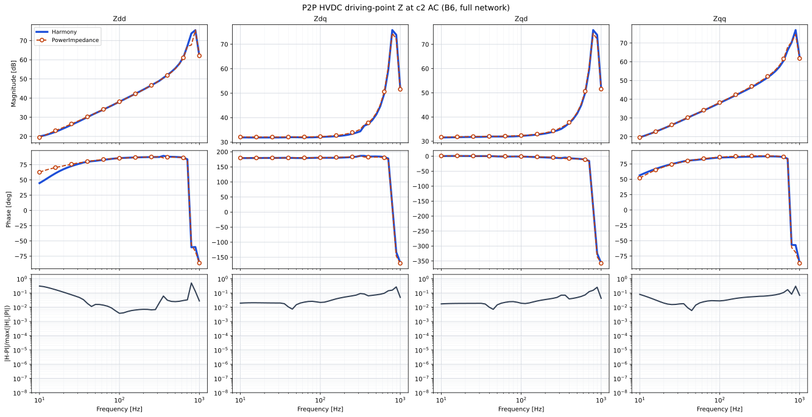
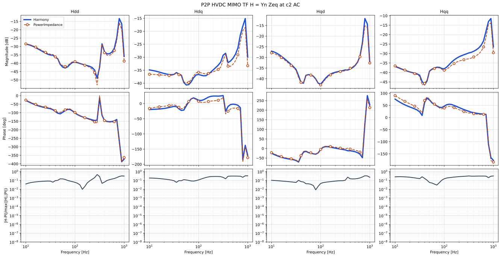

# Harmony vs PowerImpedance.jl

Standalone MMC admittance and the PowerImpedance **P2P HVDC** network, compared
against [PowerImpedance.jl](https://github.com/Electa-Git/PowerImpedance.jl)
0.3.0 (`#main`).

Overlays: Harmony **blue solid**, PowerImpedance **orange dashed** with markers
(magnitude, unwrapped phase, relative error).

Checked-in artefacts under `results/` are **SVG overlays only**. Frequency CSVs
are generated when you redo the plots and then removed.

## Redo the plots

From the repository root, with the `harmony` conda env, Gurobi on `PATH`, and
Julia 1.10+:

```bash
julia --project=benchmarking/powerimpedance -e "using Pkg; Pkg.instantiate()"
python benchmarking/powerimpedance/run_all.py
```

On Windows set `PYTHONIOENCODING=utf-8`. That script:

1. Rebuilds Harmony JSON in `harmony/`
2. Sweeps PowerImpedance (`run_pi.jl`, `run_pi_networks.jl`)
3. Runs `Harmony.exe --json … --no-plot` for each case
4. Writes `results/overlay_*.svg` via `compare.py`
5. Deletes the intermediate CSVs

Partial reruns:

```bash
python benchmarking/powerimpedance/run_all.py --skip-julia
python benchmarking/powerimpedance/run_all.py --case p2p
python benchmarking/powerimpedance/compare.py --case mmc_c1 --case p2p_tf
```

`compare.py` needs the CSVs still on disk (use it only during a run, or before
step 5 if you stop the script). Flags: `--skip-julia`, `--skip-harmony`,
`--skip-networks`, `--case`.

## Network

```
g4 -- tl1 (25 km) -- c1 -- DC cable (100 km) -- c2 -- tl78 (90 km) -- g1
```

The network cut is the inverter PCC (c2 AC / bus B6). Converter c1 is
$V_{\mathrm{dc}}+Q$ (rectifier); c2 is $P+Q$ (inverter). Plant bases are
$S=1000\,\mathrm{MW}$, $V_{\mathrm{ac,LL}}=380\,\mathrm{kV}$,
$V_{\mathrm{dc}}=800\,\mathrm{kV}$. Setpoints are
$P=\mp 100\,\mathrm{MW}$ and $Q=+100\,\mathrm{MVAR}$.

Harmony MMC uses the report Park: $Q=\tfrac32(v_q i_d-v_d i_q)$ so $Q>0$ gives $i_q<0$.
Standalone PowerImpedance wrappers pass $Q_{\mathrm{ac}}=+100$ (`pftoinputs` then sets $q_{\mathrm{ac}}=-0.1$).
The P2P network PF writes $Q_{\mathrm{ac}}$ back with a sign flip, so that case is seeded at $-100$ to land on the same plant $i_q$.
After export, AC-current rows of the PowerImpedance MMC $Y$ are negated (load vs generator current).
P2P Harmony still runs AC–DC OPF (`power_flow`, `vsc_control: true`) before linearisation.
Converter loss coefficients match PowerImpedance: $A=B=C_{\mathrm{rec}}=C_{\mathrm{inv}}=0$, $b_f=0$.

### Converter admittance

Each MMC is linearised at a solved equilibrium. With states $x$, port voltages
$u=(v_{\mathrm{dc}},v_d,v_q)$ and port currents $y=(i_{\mathrm{dc}},i_d,i_q)$,

$$
Y(s)=C(sI-A)^{-1}B+D.
$$

The AC block used in the overlays is

$$
Y_{\mathrm{ac}}(s)=\begin{pmatrix} Y_{dd}(s) & Y_{dq}(s) \\ Y_{qd}(s) & Y_{qq}(s) \end{pmatrix}.
$$

### Driving-point impedance

At B6, $Y_n$ is c2's AC admittance and $Y_{\mathrm{eq}}$ is everything else
seen from that port (tl78, g1, and the DC side through c1):

$$
Z_{\mathrm{in}}(s)=\bigl(Y_n(s)+Y_{\mathrm{eq}}(s)\bigr)^{-1}.
$$

PowerImpedance computes $Z_{\mathrm{in}}$ with `determine_impedance` at
`B6d`/`B6q`. Harmony writes $Z_{\mathrm{in}}$ from `stability_assessment`.

### Minor-loop transfer function

Eliminating c2 gives $Z_{\mathrm{eq}}$ (the AC grid looking into tl78). The
MIMO return ratio is

$$
H(s)=Z_{\mathrm{in}}^{-1}(s)\,Z_{\mathrm{eq}}(s)-I=Y_n(s)\,Z_{\mathrm{eq}}(s).
$$

## Results

Relative Frobenius $\|M_H-M_{PI}\|/\|M_{PI}\|$ on the matched log-frequency
grid (Harmony Release, 2026-08-30):

| Case | Samples | Mean | Max |
|------|---------|------|-----|
| resistor | 11 | $0$ | $0$ |
| Y-Y transformer | 41 | $1.11\times 10^{-6}$ | $3.17\times 10^{-6}$ |
| aerial cable $Y$ | 41 | $1.64\times 10^{-4}$ | $1.60\times 10^{-3}$ |
| OHL $Y$ | 41 | $2.71\times 10^{-4}$ | $2.93\times 10^{-3}$ |
| GFL MMC $Y$ | 81 | $7.21\times 10^{-4}$ | $1.43\times 10^{-3}$ |
| c1 $Y_{\mathrm{ac}}$ (Vdc+Q) | 81 | $7.40\times 10^{-4}$ | $1.95\times 10^{-3}$ |
| c2 $Y_{\mathrm{ac}}$ (P+Q) | 81 | $9.42\times 10^{-4}$ | $2.16\times 10^{-3}$ |
| P2P DC cable $Y$ (phase 4×4) | 41 | $2.39\times 10^{-4}$ | $1.65\times 10^{-3}$ |
| $Z_{\mathrm{in}}$ at B6 | 41 | $5.25\times 10^{-2}$ | $0.329$ |
| $H$ at B6 | 41 | $0.200$ | $0.417$ |

### Standalone c1 ($V_{\mathrm{dc}}+Q$)



### Standalone c2 ($P+Q$)



### $Z_{\mathrm{in}}$ at B6



### $H$ at B6


