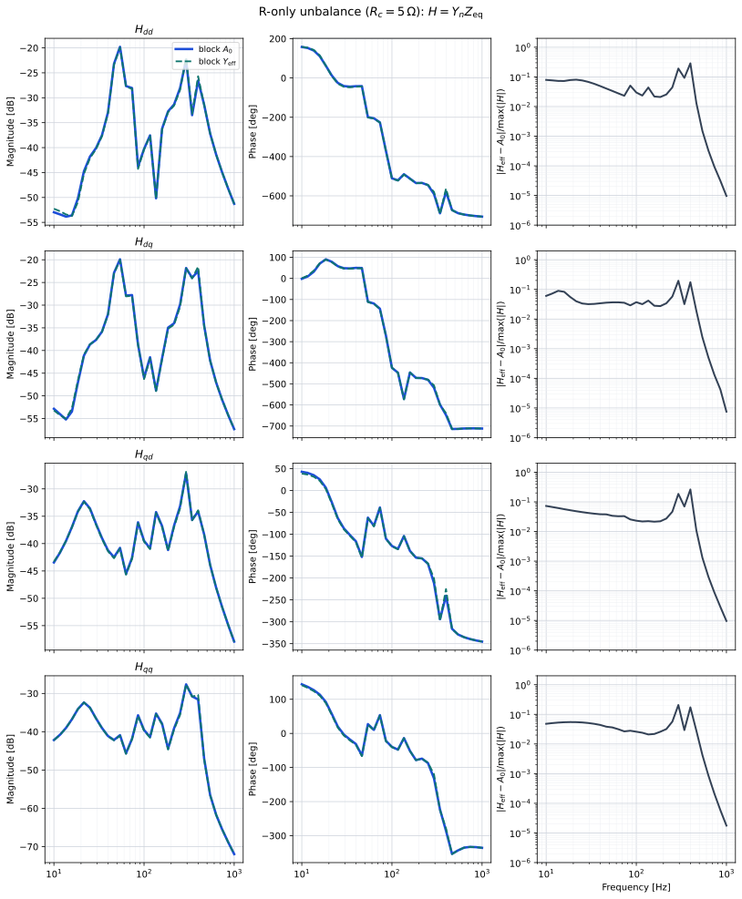
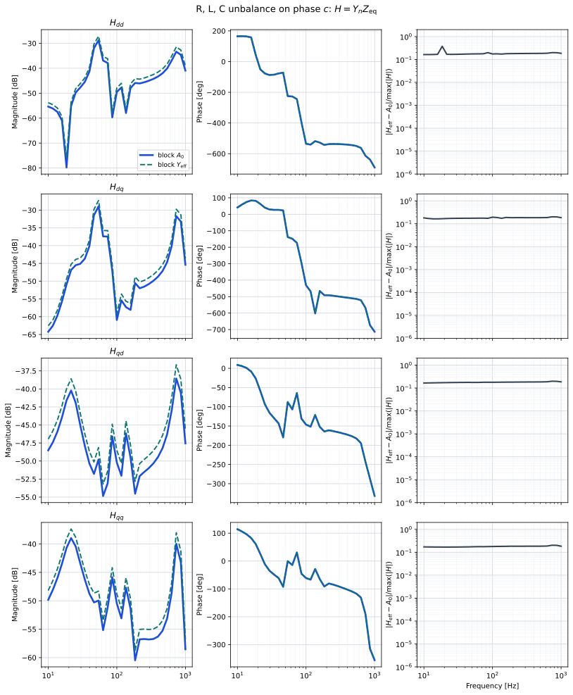

# Unbalanced AC block: $A_0$ vs $Y_{\mathrm{eff}}$

Harmony comparison of **block** Park $A_0$ (Tier 1) against the $N_h=1$
effective admittance $Y_{\mathrm{eff}}$ (Tier 2) on a small MMC network with
one unbalanced phase resistance. The cut is the MMC AC port.

Overlays: block $A_0$ **blue solid**, block $Y_{\mathrm{eff}}$ **teal dashed**.
Each row is one entry of $H$, stacked $H_{dd}$, $H_{dq}$, $H_{qd}$, $H_{qq}$
(magnitude, unwrapped phase, relative error).

Checked-in artefacts under `results/` are **SVG overlays only**. Frequency CSVs
are generated when you redo the plots and then removed.

## Redo the plots

From the repository root, with the `harmony` conda env and a Release
`Harmony.exe`:

```bash
python benchmarking/unbalanced_yeff/run.py
```

On Windows set `PYTHONIOENCODING=utf-8`. That script:

1. Runs `Harmony.exe --json` for the R-only case and the R/L/C-unbalance case
2. Copies the $A_0$ and $Y_{\mathrm{eff}}$ TF CSVs
3. Writes `results/overlay_H.svg` and `results/overlay_H_strong.svg`
4. Deletes the intermediate CSVs

JSON flags (both optional; omit them for per-component $A_0$):

```json
"park_per_component": false,
"yeff": true
```

`yeff: true` always assembles abc $Y$ once per AC block and applies (18).

## Network

```
Vs_ac -- R -- L -- Bpcc -- MMC -- Vs_dc
                 |
                 C (shunt)
```

Phase resistances are $R_a=R_b=1\,\Omega$, $R_c=5\,\Omega$. Series $L=10\,\mathrm{mH}$,
shunt $C=20\,\mu\mathrm{F}$. The AC source has $Z=0.5\,\Omega$; the DC source is
bipolar $\pm 200\,\mathrm{V}$. OPF is skipped (`skip_opf: true`); the MMC is
linearised from its converter setpoints.

The study cut is MMC1 AC / bus Bpcc.

A second JSON, `harmony/mmc_unbalanced_rlc_strong.json`, keeps the same
topology but unbalances phase $c$ on all three passives:

$$
R_c=10\,\Omega,\qquad L_c=20\,\mathrm{mH},\qquad C_c=2\,\mu\mathrm{F}
$$

($R_{ab}=1\,\Omega$, $L_{ab}=2\,\mathrm{mH}$, $C_{ab}=20\,\mu\mathrm{F}$).
The $R$-only case makes $C_{\pm}$ small once $\omega L\gg R$; unbalancing $L$
and $C$ keeps $\sigma_T(\omega)$ large across the scan.

## Block Park maps

Let $Y_{\mathrm{abc}}(j\omega)$ be the assembled $3n\times 3n$ abc port
admittance of the AC area (converters excluded). With
$v^{\mathrm{T}}=[1,\,j]$, $e^{\mathrm{T}}=[1,\,e^{j\varphi},\,e^{2j\varphi}]$,
$\varphi=-2\pi/3$, and $\omega_o=2\pi\cdot 50$,

$$
\sigma_H(\omega)=e^{\mathrm{T}} Y_{\mathrm{abc}}(j\omega)\,e^{\ast},\qquad
\sigma_T(\omega)=e^{\mathrm{T}} Y_{\mathrm{abc}}(j\omega)\,e,
$$

$$
M_H=vv^{\mathrm{H}}=\begin{pmatrix}1 & -j\\ j & 1\end{pmatrix},\qquad
M_T=vv^{\mathrm{T}}=\begin{pmatrix}1 & j\\ j & -1\end{pmatrix}.
$$

The diagonal and coupling $2\times 2$ blocks (per port pair) are

$$
A_0(\omega)=\frac16\Bigl[\sigma_H(\omega-\omega_o)\,M_H
+\sigma_H^{\ast}(\omega+\omega_o)\,M_H^{\ast}\Bigr],
$$

$$
C_-(\omega)=\frac16\,\sigma_T(\omega-\omega_o)\,M_T,\qquad
C_+(\omega)=\frac16\bigl[\sigma_T(\omega+\omega_o)\bigr]^{\ast} M_T^{\ast}.
$$

Retaining harmonics $h\in\{-1,0,+1\}$ in the $2\omega_o$-indexed lift and
eliminating $h=\pm 1$ by a Schur complement gives the effective $dq$
admittance

$$
Y_{\mathrm{eff}}(\omega)=A_0(\omega)
-C_-(\omega)\,A_0(\omega-2\omega_o)^{-1} C_+(\omega-2\omega_o)
-C_+(\omega)\,A_0(\omega+2\omega_o)^{-1} C_-(\omega+2\omega_o).
$$

$A_0$ depends only on the positive-sequence part of $Y_{\mathrm{abc}}$. The
correction is $\mathcal{O}(\varepsilon^2)$ in the unbalance $\varepsilon$
(via $Y_{PN}$). $Y_{\mathrm{eff}}$ is exact within the $N_h=1$ truncation
away from poles of $G^{-1}=\mathrm{blkdiag}\bigl(A_0(\omega-2\omega_o),A_0(\omega+2\omega_o)\bigr)^{-1}$.

## Transfer function

At the MMC AC cut, $Y_n$ is the converter AC block with the DC port closed
through $V_{\mathrm{s,dc}}$, and $Y_{\mathrm{eq}}$ is the passive AC network
($A_0$ or $Y_{\mathrm{eff}}$). The MIMO return ratio is

$$
H(s)=Y_n(s)\,Z_{\mathrm{eq}}(s)=Y_n(s)\,Y_{\mathrm{eq}}(s)^{-1}
=\begin{pmatrix} H_{dd} & H_{dq} \\ H_{qd} & H_{qq} \end{pmatrix}.
$$

## Results

Relative Frobenius $\|H_{\mathrm{eff}}-A_0\|/\|A_0\|$ on the log-frequency
grid (Harmony Release, 2026-08-30), $31$ samples from $10\,\mathrm{Hz}$ to
$1\,\mathrm{kHz}$:

| Case | Mean | Max | $f$ at max |
|------|------|-----|------------|
| $R_c=5\,\Omega$ only | $4.46\times 10^{-2}$ | $0.234$ | $398\,\mathrm{Hz}$ |
| $R,L,C$ unbalance on $c$ | $0.216$ | $0.249$ | $736\,\mathrm{Hz}$ |

The $R$-only traces coincide above about $500\,\mathrm{Hz}$. With unbalanced
$L$ and $C$ the mean error stays around $20\%$ over the whole band.

### $H$ at the MMC AC cut ($R_c$ only)



### $H$ at the MMC AC cut ($R$, $L$, $C$ unbalance)


