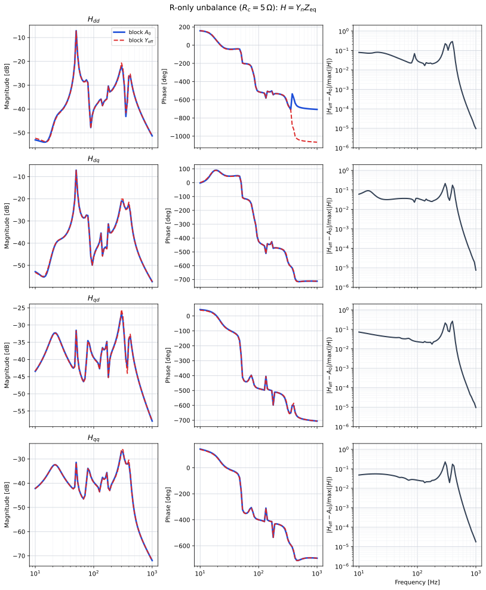
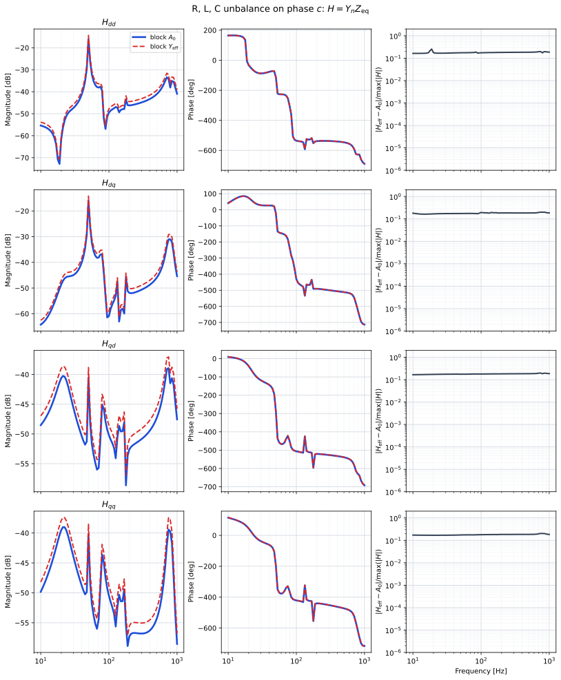
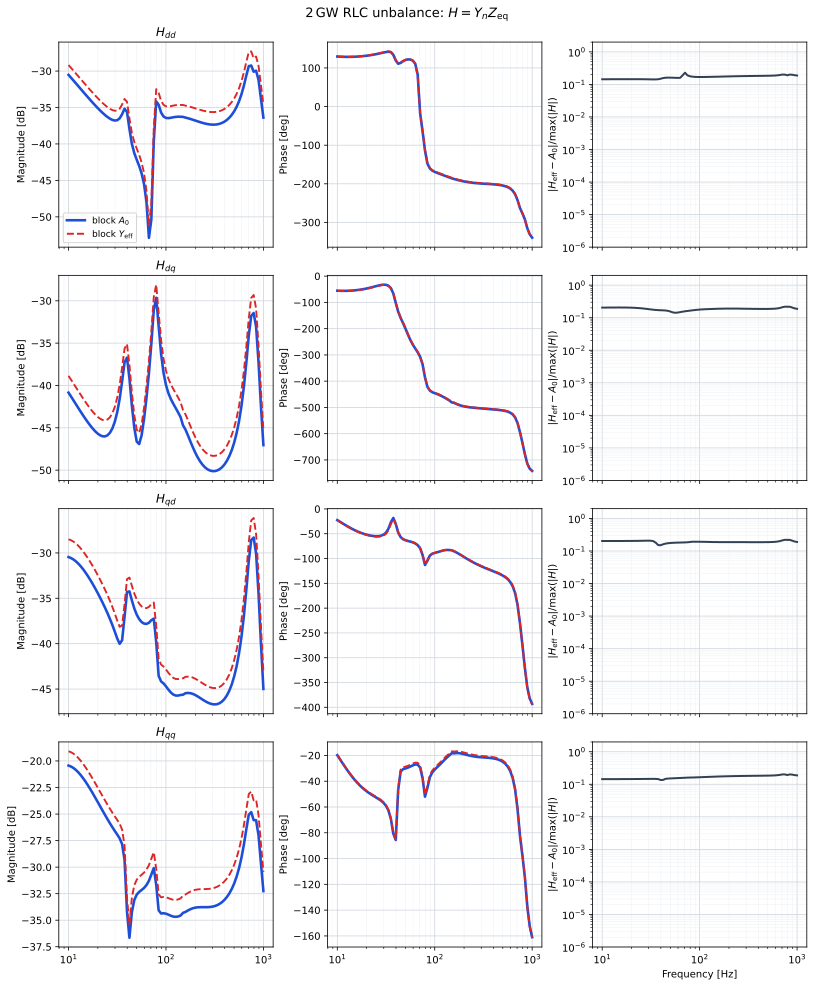
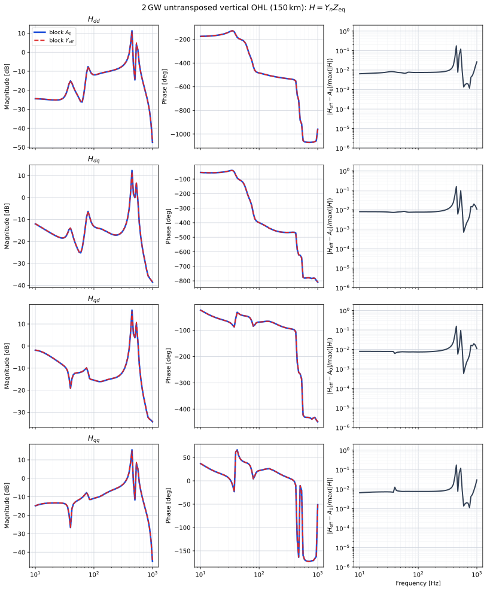
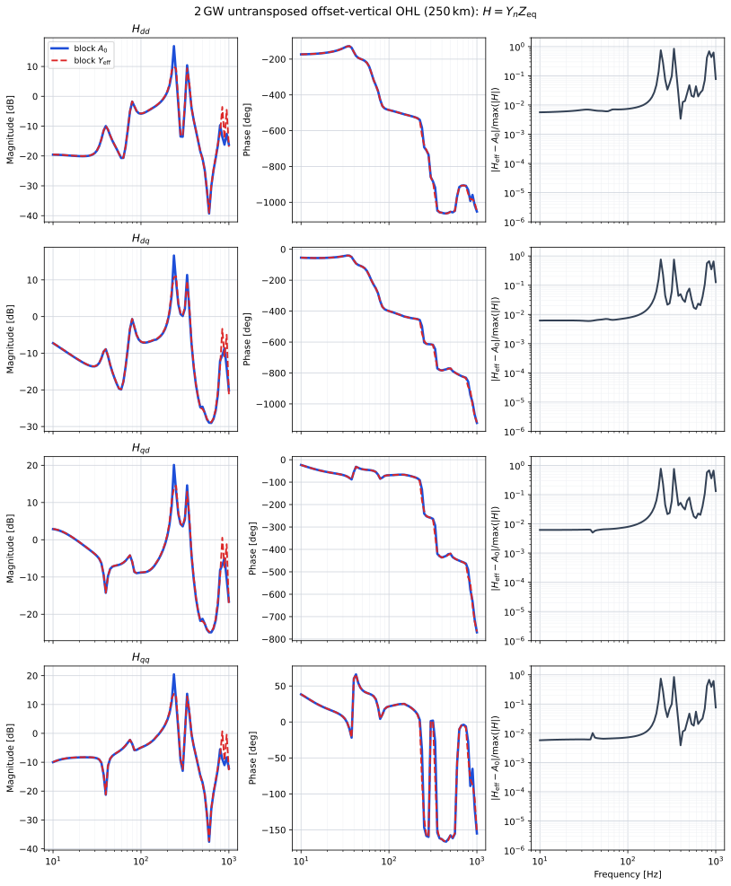

# Unbalanced AC block: $A_0$ vs $Y_{\mathrm{eff}}$

Harmony comparison of **block** Park $A_0$ against the $N_h=1$ effective
admittance $Y_{\mathrm{eff}}$ on a one-MMC network. The cut is the MMC AC
port. Overlays: block $A_0$ **blue solid**, block $Y_{\mathrm{eff}}$ **red
dashed**.

```
unbalanced_yeff/
  run.py  plot.py
  rlc/
    mmc_unbalanced_rlc.json
    mmc_unbalanced_rlc_strong.json
    mmc_unbalanced_rlc_2gw.json
    results/overlay_H{,_strong,_2gw}.svg
  ohl/
    mmc_unbalanced_ohl_2gw.json
    mmc_unbalanced_ohl_conc_2gw.json
    results/overlay_H_ohl{,_conc}.svg
```

Checked-in artefacts are **SVG overlays only**.

## Redo the plots

```bash
conda run -n harmony python benchmarking/unbalanced_yeff/run.py
```

Optional: `--only rlc`, `--only strong`, `--only 2gw`, `--only ohl`,
`--only ohl_conc`. The script finds `build/Release/Harmony.exe`, runs both
$A_0$ and $Y_{\mathrm{eff}}$ scans, writes SVGs, and deletes intermediate
CSVs.

JSON flags (optional; omit them for per-component $A_0$):

```json
"park_per_component": false,
"yeff": true
```

OPF is skipped (`skip_opf: true`). Do not evaluate $Y_{\mathrm{eff}}$ at
exactly $50\,\mathrm{Hz}$ or $150\,\mathrm{Hz}$.

## Execution times

Wall times on this machine (2026-09-01, Harmony Release). Each case is two
stability scans (block $A_0$ and $Y_{\mathrm{eff}}$).

| Case | Typical wall |
|------|----------------|
| `rlc` / `strong` / `2gw` | ~10–15 s each |
| `ohl` (150 km vertical) | ~15 s |
| `ohl_conc` (250 km offset-vertical) | ~13 s |
| all five | ~1–2 min |

`run.py` prints per-case `wall=` and a total at the end.

## Cases

**RLC** (`rlc/`):

```
Vs_ac -- R -- L -- Bpcc -- MMC -- Vs_dc
                 |
                 C (shunt)
```

| Key | JSON | Unbalance |
|-----|------|-----------|
| `rlc` | `mmc_unbalanced_rlc.json` | $R_a=R_b=1\,\Omega$, $R_c=5\,\Omega$ |
| `strong` | `mmc_unbalanced_rlc_strong.json` | $R,L,C$ all changed on phase $c$ |
| `2gw` | `mmc_unbalanced_rlc_2gw.json` | $2\,\mathrm{GW}$, $\pm 525\,\mathrm{kV}$, same RLC pattern |

**OHL** (`ohl/`), same $2\,\mathrm{GW}$ MMC, stiff AC bus:

```
Vs_ac -- OHL -- Bpcc -- MMC -- Vs_dc
```

| Key | JSON | Line |
|-----|------|------|
| `ohl` | `mmc_unbalanced_ohl_2gw.json` | 150 km vertical, twin bundle |
| `ohl_conc` | `mmc_unbalanced_ohl_conc_2gw.json` | 250 km offset-vertical (concentric), $\Delta\tilde{x}=4\,\mathrm{m}$ |

The 150 km vertical corridor is close to balanced. The 250 km offset-vertical
tower enlarges $Y_{PN}$; $\lambda/4$ is near $340\,\mathrm{Hz}$ and a Schur
peak sits near $840\,\mathrm{Hz}$.

## Block Park maps

Let $Y_{\mathrm{abc}}(j\omega)$ be the assembled $3n\times 3n$ abc port
admittance of the AC area (converters excluded). With
$v^{\mathrm{T}}=[1,\,j]$, $e^{\mathrm{T}}=[1,\,e^{j\varphi},\,e^{2j\varphi}]$,
$\varphi=-2\pi/3$, and $\omega_o=2\pi\cdot 50$,

$$
\sigma_H(\omega)=e^{\mathrm{T}} Y_{\mathrm{abc}}(j\omega)\,e^{\ast},\qquad
\sigma_T(\omega)=e^{\mathrm{T}} Y_{\mathrm{abc}}(j\omega)\,e,
$$

$$
A_0(\omega)=\frac16\Bigl[\sigma_H(\omega-\omega_o)\,M_H
+\sigma_H^{\ast}(\omega+\omega_o)\,M_H^{\ast}\Bigr],
$$

$$
Y_{\mathrm{eff}}(\omega)=A_0(\omega)
-C_-(\omega)\,A_0(\omega-2\omega_o)^{-1} C_+(\omega-2\omega_o)
-C_+(\omega)\,A_0(\omega+2\omega_o)^{-1} C_-(\omega+2\omega_o).
$$

At the MMC AC cut, $H(s)=Y_n(s)\,Z_{\mathrm{eq}}(s)$.

## Results

Relative Frobenius $\|H_{\mathrm{eff}}-A_0\|/\|A_0\|$, 81 samples from
$10\,\mathrm{Hz}$ to $1\,\mathrm{kHz}$ (Harmony Release, 2026-09-01):

| Case | Mean | Max | $f$ at max |
|------|------|-----|------------|
| $R_c=5\,\Omega$ only | $4.30\times 10^{-2}$ | $0.247$ | $299\,\mathrm{Hz}$ |
| $R,L,C$ unbalance on $c$ | $0.216$ | $0.249$ | $750\,\mathrm{Hz}$ |
| $2\,\mathrm{GW}$ RLC unbalance | $0.204$ | $0.261$ | $750\,\mathrm{Hz}$ |
| $2\,\mathrm{GW}$ untransposed vertical OHL | $1.18\times 10^{-2}$ | $0.163$ | $447\,\mathrm{Hz}$ |
| $2\,\mathrm{GW}$ offset-vertical OHL $250\,\mathrm{km}$ | $9.51\times 10^{-2}$ | $1.77$ | $841\,\mathrm{Hz}$ |

### $H$ at the MMC AC cut ($R_c$ only)



### $H$ at the MMC AC cut ($R$, $L$, $C$ unbalance)



### $H$ at the MMC AC cut ($2\,\mathrm{GW}$, $\pm 525\,\mathrm{kV}$)



### $H$ at the MMC AC cut ($2\,\mathrm{GW}$ untransposed vertical OHL)



### $H$ at the MMC AC cut ($2\,\mathrm{GW}$ offset-vertical OHL, $250\,\mathrm{km}$)


