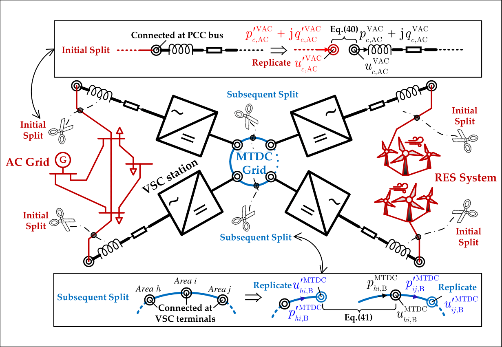

# Harmony User Manual

**HARMONic stabilitY assessment of PE-penetrated power systems**

Version: draft (August 2026)  
License: GPL v3  
Project: [CRESYM/Harmony](https://github.com/CRESYM/Harmony)



---

## About this manual

This manual is the **narrative guide** for researchers and engineers who install Harmony and run stability / OPF / time-domain studies. It explains concepts, workflows, and examples.

All documentation lives under [`docs/`](../README.md). Use that index if you are unsure which page to open.

---

## Companion references (same `docs/` tree)

| Need | Document | Relation to this manual |
|------|----------|-------------------------|
| Step-by-step install (screenshots) | [installation.md](../installation.md) | Expands [Chapter 2](02-getting-started.md) |
| Day-to-day run (conda, paths, VS) | [running-harmony.md](../running-harmony.md) | Pairs with [Ch. 11](11-command-line.md) / [Ch. 12](12-harmony-ui.md) |
| Every JSON key / type | [input-file-format.md](../input-file-format.md) | Spec behind [Chapter 5](05-json-input.md) |
| C++ class reference | [Doxygen](../doxygen/README.md) | API, not tutorials |
| Extending / CI | [Developer](../developer-guide.md) · [Maintainer](../maintainer-guide.md) | Outside this manual’s scope |

Certificates live **in** this manual: [Chapter 8](08-certificates.md) (detail) and [Chapter 7 § 7.10](07-analysis-workflows.md#710-device-certificates) (overview).

---

## Table of contents

| Chapter | Title | Description |
|---------|-------|-------------|
| [1](01-introduction.md) | Introduction | Scope, capabilities, and analysis types |
| [2](02-getting-started.md) | Getting started | Install, build, run your first example |
| [3](03-core-concepts.md) | Core concepts | Network, buses, elements, areas |
| [4](04-building-networks.md) | Building networks in C++ | Programmatic model assembly |
| [5](05-json-input.md) | JSON input workflow | File-driven simulations |
| [6](06-component-reference.md) | Component reference | Parameters for major device types |
| [7](07-analysis-workflows.md) | Analysis workflows | OPF, stability, DQsym, certificates overview |
| [8](08-certificates.md) | Certificates | Passivity / geometric certificate APIs |
| [9](09-examples-catalog.md) | Examples catalog | Guide to all bundled examples |
| [10](10-troubleshooting.md) | Troubleshooting | Common errors and fixes |
| [11](11-command-line.md) | Command-line interface | `--cpp` / `--json` reference |
| [12](12-harmony-ui.md) | HarmonyUI | Graphical launcher, plots, PNG export |

---

## Quick reference

| Task | Where to look |
|------|----------------|
| First-time install | [Chapter 2](02-getting-started.md) · [installation.md](../installation.md) |
| Run Harmony (GUI) | [Chapter 12](12-harmony-ui.md) · [running-harmony.md](../running-harmony.md) |
| Run Harmony (CLI) | [Chapter 11](11-command-line.md) · [running-harmony.md](../running-harmony.md) |
| Hybrid AC–DC stability | `Harmony --cpp stability_check` · [Chapter 7](07-analysis-workflows.md) |
| Optimal power flow | `Harmony --cpp opf` · [Chapter 7](07-analysis-workflows.md) |
| Device certificates | `Harmony --cpp certificate_figures` · [Chapter 8](08-certificates.md) |
| Define a case without C++ | `Harmony --json …` · [Chapter 5](05-json-input.md) |
| MMC parameters | [Chapter 6 § MMC](06-component-reference.md#62-modular-multilevel-converter-mmc) |
| Unit tests | [Chapter 2 § Tests](02-getting-started.md#27-running-the-test-suite) |
| Full docs map | [docs/README.md](../README.md) |

---

## How Harmony is organized

```
Harmony/
├── src/                  Main library, CLI, UI, examples, json/
├── tests/                GoogleTest suite
├── install/              Installer project + res/ assets (incl. HARMONY_figure.png)
└── docs/                 Documentation hub → README.md
    ├── manual/           This user manual (chapters 1–12)
    ├── installation.md
    ├── running-harmony.md
    ├── input-file-format.md
    └── doxygen/          API docs build instructions
```

---

## Support and citation

Harmony was developed at Delft University of Technology with support from the [Digital Competence Centre](https://www.tudelft.nl/en/2021/tu-delft/organisatie/faculteiten/electrical-engineering-mathematics-and-computer-science/departments/intelligent-electrical-power-grids/electa/digital-competence-centre).

When publishing results obtained with Harmony, cite the project repository and the underlying methods referenced in the [README](../../README.md#references).
